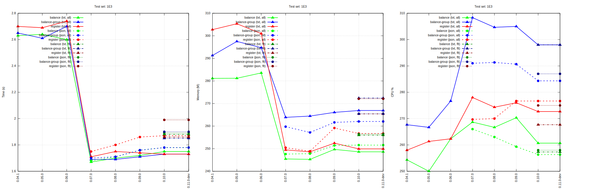
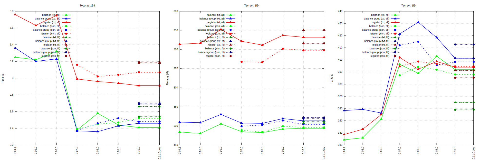
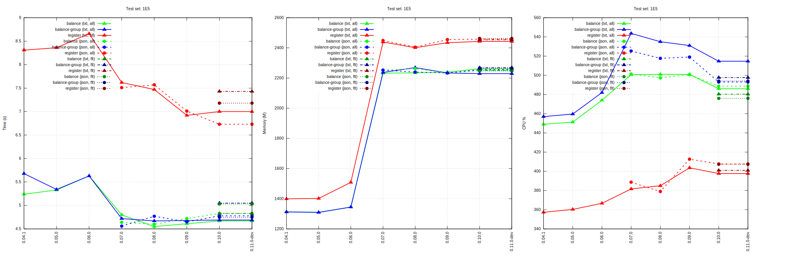
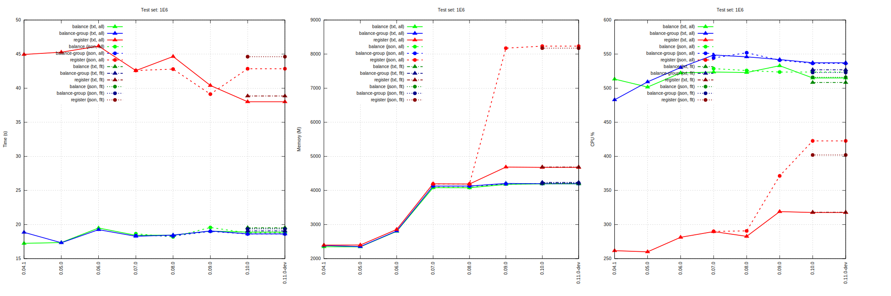

= HW00 (server) performance results

----
cpu: Intel(R) Xeon(R) CPU E3-1265L V2 @ 2.50GHz
hd: Intel® SSD 530 Series
mem: 32GB
----
Raw test results: link:./hw00/[HW00 (server)]

== perf-1E3

== perf-1E4

== perf-1E5

== perf-1E6

'''
Tackler is distributed on an *"AS IS" BASIS, WITHOUT WARRANTIES OR CONDITIONS OF ANY KIND*, either express or implied.
See the link:../../LICENSE[License] for the specific language governing permissions and limitations under
the link:../../LICENSE[License].
