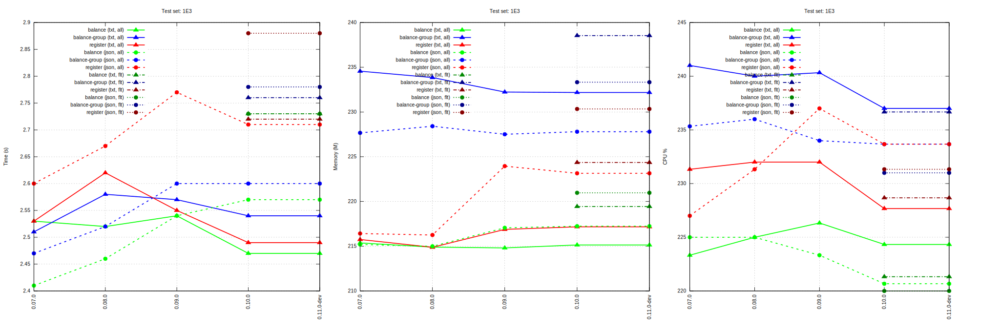
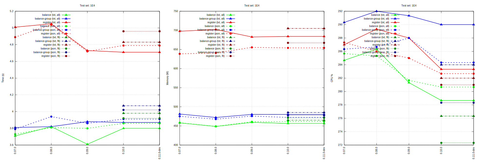
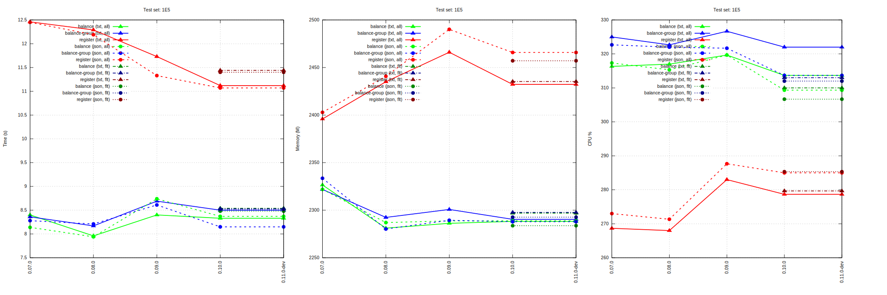
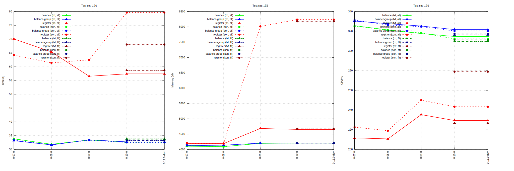

= HW01 (laptop) performance results

----
cpu: Intel(R) Core(TM) i5-2540M CPU @ 2.60GHz
hd: Intel(R) SSD 535
mem: 16GB
----
Raw test results: link:./hw01/[HW01 (laptop)]

== perf-1E3

== perf-1E4

== perf-1E5

== perf-1E6

'''
Tackler is distributed on an *"AS IS" BASIS, WITHOUT WARRANTIES OR CONDITIONS OF ANY KIND*, either express or implied.
See the link:../../LICENSE[License] for the specific language governing permissions and limitations under
the link:../../LICENSE[License].
